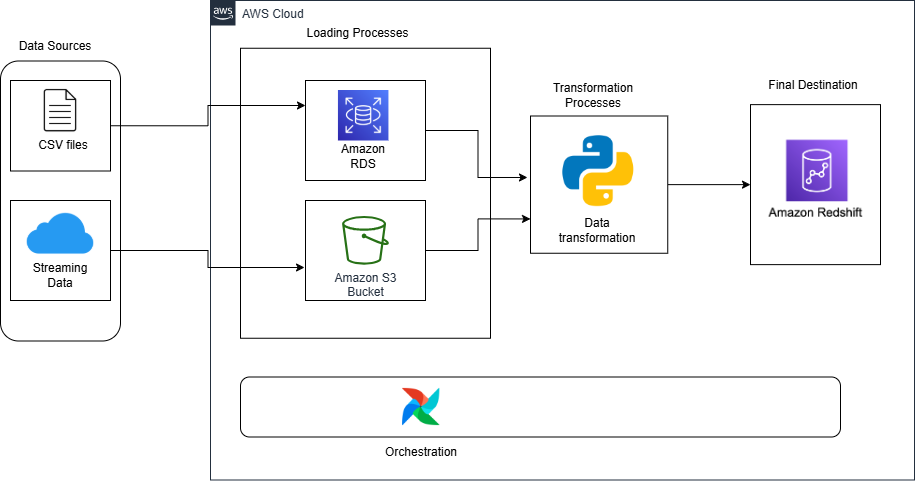
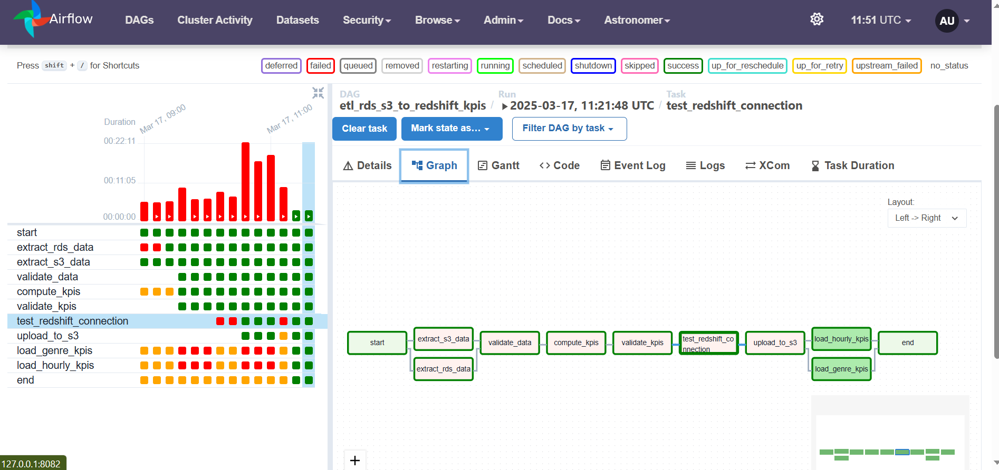

# Music Streaming ETL Pipeline

## Overview

This project implements an automated ETL (Extract, Transform, Load) pipeline for processing music streaming data using Apache Airflow. The pipeline extracts data from multiple sources, computes key performance indicators (KPIs), and loads the results into Amazon Redshift for analysis.

## Architecture



The pipeline performs the following operations:

1. Extracts user and song data from RDS PostgreSQL
2. Pulls streaming data from S3 buckets
3. Validates data quality
4. Computes genre-based and hourly KPIs
5. Loads processed data into Redshift for analytics

## DAG Structure



The main DAG (`music_streaming_etl_dags.py`) consists of the following tasks:

- Data extraction from RDS and S3
- Data validation
- KPI computation
- Redshift connection testing
- S3 upload of processed data
- Loading data into Redshift tables

## Prerequisites

- Docker
- Astronomer CLI
- AWS Account with access to:
  - S3
  - RDS
  - Redshift

## Project Structure

```
.
├── dags/
│   ├── music_streaming_etl_dags.py
│   └── example_astronauts.py
├── tests/
│   └── dags/
│       └── test_dag_example.py
├── docs/
│   └── images/
│       ├── airflow_dags.png
│       └── music_streaming_etl_architecture.png
├── include/
├── plugins/
├── Dockerfile
├── packages.txt
├── requirements.txt
└── airflow_settings.yaml
```

## Setup and Installation

1. Install the Astronomer CLI:

```bash
curl -sSL https://install.astronomer.io | sudo bash
```

2. Initialize the project:

```bash
astro dev init
```

3. Configure Airflow connections in `airflow_settings.yaml`:
   
   - AWS S3 (`aws_s3_conn`)
   - RDS PostgreSQL (`rds_conn`)
   - Redshift (`redshift_conn`)

4. Start the local Airflow environment:

```bash
astro dev start
```

5. Access the Airflow UI at `http://localhost:8080`
   - Username: admin
   - Password: admin

## DAG Configuration

The ETL pipeline runs hourly and includes the following main components:

- Data Extraction:
  - User and song data from RDS
  - Streaming data from S3
- Data Validation:
  - Null checks
  - Data type validation
  - Record count verification
- KPI Computation:
  - Genre-based metrics
  - Hourly listening patterns
- Data Loading:
  - Intermediate storage in S3
  - Final loading into Redshift

## Testing

Run the test suite using:

```bash
pytest tests/
```

## Development

1. Make changes to DAGs in the `dags/` directory
2. Test locally using `astro dev restart`
3. Monitor logs with `astro dev logs`

## Deployment

Deploy to Astronomer Cloud:

```bash
astro deploy
```

## Contributing

1. Fork the repository
2. Create a feature branch
3. Commit changes
4. Push to the branch
5. Create a Pull Request

## License

This project is licensed under the MIT License - see the LICENSE file for details.

## Support

For issues and questions, please create an issue in the repository or contact the development team.
